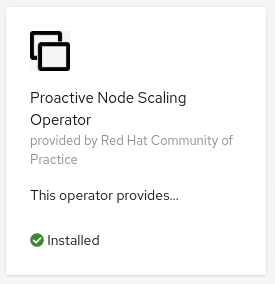

# Proactive Node Scaling Operator


[](https://goreportcard.com/report/github.com/redhat-cop/proactive-node-scaling-operator)


This operator makes the [cluster autoscaler](https://github.com/kubernetes/autoscaler/tree/master/cluster-autoscaler) more proactive. As of now the cluster auto scaler will create new nodes only when a pod is pending because it cannot be allocated due to lack of capacity. This is not a good user experience as the pending workload has to wait for several minutes as the new node is create and joins the cluster.

The Proactive Node Scaling Operator improves the user experience by allocating low priority pods that don't do anything. When the cluster is full and a new user pod is created the following happens:

1. some of the low priority pods are de-scheduled to make room for the user pod, which can then be scheduled. The user workload does not have to wait in this case.

2. the de-scheduled low priority pods are rescheduled and in doing so, trigger the cluster autoscaler to add new nodes.

Essentially this operator allows you to trade wasted resources for faster response time.

In order for this operator to work correctly [pod priorities](https://kubernetes.io/docs/concepts/configuration/pod-priority-preemption/) must be defined. The default name for the priority class used by this operator is "proactive-node-autoscaling-pods" and it should have the lowest possible priority, 0. To ensure your regular workloads get a normal priority you should also define a PriorityClass for those and set globalDefault to true.

For example:

```yaml
apiVersion: scheduling.k8s.io/v1
kind: PriorityClass
metadata:
  name: proactive-node-autoscaling-pods
value: 0
globalDefault: false
description: "This priority class is is the Priority class for Proactive Node Scaling."
---
apiVersion: scheduling.k8s.io/v1
kind: PriorityClass
metadata:
  name: normal-workload
value: 1000
globalDefault: true
description: "This priority classis the cluster default and should be used for normal workloads."
```

Also for this operator to work the [cluster autoscaler](https://github.com/kubernetes/autoscaler/tree/master/cluster-autoscaler) must be active, see OpenShift instructions [here](https://docs.openshift.com/container-platform/4.6/machine_management/applying-autoscaling.html) on how to turn it on.

To activate the proactive autoscaling, a CR must be defined, here is an example:

```yaml
apiVersion: redhatcop.redhat.io/v1alpha1
kind: NodeScalingWatermark
metadata:
  name: us-west-2a
spec:
  priorityClassName: proactive-node-autoscaling-pods
  watermarkPercentage: 20
  nodeSelector:
    topology.kubernetes.io/zone: us-west-2a
```

The `nodeSelector` selects the nodes observed by this operator, which are also the nodes on which the low priority pods will be scheduled. The nodes observed by the cluster autoscaler should coincide with the nodes selected by this operator CR.

The `watermarkPercentage` define the percentage of capacity of user workload that will be allocated to low priority pods. So in this example 20% of the user allocated capacity will be allocated via low priority pods. This also means that when the user workload reaches 80% capacity of the nodes selected by this CR (and the autoscaler), the cluster will start to scale.

## Deploying the Operator

This is a cluster-level operator that you can deploy in any namespace, `proactive-node-scaling-operator` is recommended.

It is recommended to deploy this operator via [`OperatorHub`](https://operatorhub.io/), but you can also deploy it using [`Helm`](https://helm.sh/).

> :lock: **Disconnected Installation Supported**

### Deploying from OperatorHub

If you want to utilize the Operator Lifecycle Manager (OLM) to install this operator, you can do so in two ways: from the UI or the CLI.

#### Deploying from OperatorHub UI

* If you would like to launch this operator from the UI, you'll need to navigate to the OperatorHub tab in the console. Before starting, make sure you've created the namespace that you want to install this operator in by running the following:

```shell
oc new-project proactive-node-scaling-operator
```

* Once there, you can search for this operator by name: `proactive node scaling operator`. This will then return an item for our operator and you can select it to get started. Once you've arrived here, you'll be presented with an option to install, which will begin the process.
* After clicking the install button, you can then select the namespace that you would like to install this to as well as the installation strategy you would like to proceed with (`Automatic` or `Manual`).
* Once you've made your selection, you can select `Subscribe` and the installation will begin. After a few moments you can go ahead and check your namespace and you should see the operator running.



#### Deploying from OperatorHub using CLI

If you'd like to launch this operator from the command line, you can use the manifests contained in this repository by running the following:

oc new-project proactive-node-scaling-operator

```shell
oc apply -f config/operatorhub -n proactive-node-scaling-operator
```

This will create the appropriate OperatorGroup and Subscription and will trigger OLM to launch the operator in the specified namespace.

### Deploying with Helm

Here are the instructions to install the latest release with Helm.

```shell
oc new-project proactive-node-scaling-operator
helm repo add proactive-node-scaling-operator https://redhat-cop.github.io/proactive-node-scaling-operator
helm repo update
helm install proactive-node-scaling-operator proactive-node-scaling-operator/proactive-node-scaling-operator
```

This can later be updated with the following commands:

```shell
helm repo update
helm upgrade proactive-node-scaling-operator proactive-node-scaling-operator/proactive-node-scaling-operator
```

### Disconnected deployment

Use the `PausePodImage` field of the `NodeScalingWatermark` to specify an internally mirrored pause pod image, when running in a disconnected environment.

## Metrics

Prometheus compatible metrics are exposed by the Operator and can be integrated into OpenShift's default cluster monitoring. To enable OpenShift cluster monitoring, label the namespace the operator is deployed in with the label `openshift.io/cluster-monitoring="true"`.

```shell
oc label namespace <namespace> openshift.io/cluster-monitoring="true"
```

### Testing metrics

```sh
export operatorNamespace=proactive-node-scaling-operator-local # or proactive-node-scaling-operator
oc label namespace ${operatorNamespace} openshift.io/cluster-monitoring="true"
oc rsh -n openshift-monitoring -c prometheus prometheus-k8s-0 /bin/bash
export operatorNamespace=proactive-node-scaling-operator-local # or proactive-node-scaling-operator
curl -v -s -k -H "Authorization: Bearer $(cat /var/run/secrets/kubernetes.io/serviceaccount/token)" https://proactive-node-scaling-operator-controller-manager-metrics.${operatorNamespace}.svc.cluster.local:8443/metrics
exit
```

## Development

### Running the operator locally

```shell
make install
export TEMPLATE_FILE_NAME=./config/templates/watermarkDeploymentTemplate.yaml
oc new-project proactive-node-scaling-operator-local
kustomize build ./config/local-development | oc apply -f - -n proactive-node-scaling-operator-local
export token=$(oc serviceaccounts get-token 'proactive-node-scaling-controller-manager' -n proactive-node-scaling-operator-local)
oc login --token ${token}
make run ENABLE_WEBHOOKS=false
```

### Test helm chart locally

Define an image and tag. For example...

```shell
export imageRepository="quay.io/redhat-cop/proactive-node-scaling-operator"
export imageTag="$(git describe --tags --abbrev=0)" # grabs the most recent git tag, which should match the image tag
```

Deploy chart...

```shell
make helmchart
helm upgrade -i proactive-node-scaling-operator-helmchart-test charts/proactive-node-scaling-operator -n proactive-node-scaling-operator-local --set image.repository=${imageRepository} --set image.tag=${imageTag} --create-namespace
```

Delete...

```shell
helm delete proactive-node-scaling-operator-helmchart-test -n proactive-node-scaling-operator-local
kubectl delete -f charts/proactive-node-scaling-operator/crds/crds.yaml
```

### Building/Pushing the operator image

```shell
export repo=raffaelespazzoli #replace with yours
docker login quay.io/$repo/proactive-node-scaling-operator
make docker-build IMG=quay.io/$repo/proactive-node-scaling-operator:latest
make docker-push IMG=quay.io/$repo/proactive-node-scaling-operator:latest
```

### Deploy to OLM via bundle

```shell
make manifests
make bundle IMG=quay.io/$repo/proactive-node-scaling-operator:latest
operator-sdk bundle validate ./bundle --select-optional name=operatorhub
make bundle-build BUNDLE_IMG=quay.io/$repo/proactive-node-scaling-operator-bundle:latest
docker login quay.io/$repo/proactive-node-scaling-operator-bundle
docker push quay.io/$repo/proactive-node-scaling-operator-bundle:latest
operator-sdk bundle validate quay.io/$repo/proactive-node-scaling-operator-bundle:latest --select-optional name=operatorhub
oc new-project proactive-node-scaling-operator
oc label namespace proactive-node-scaling-operator openshift.io/cluster-monitoring="true"
operator-sdk cleanup proactive-node-scaling-operator -n proactive-node-scaling-operator
operator-sdk run bundle --install-mode AllNamespaces -n proactive-node-scaling-operator quay.io/$repo/proactive-node-scaling-operator-bundle:latest
```

### Testing

Create the following resource:

```shell
oc new-project proactive-node-scaling-operator-test
oc apply -f ./test/ai-ml-watermark.yaml -n proactive-node-scaling-operator-test
oc apply -f ./test/zone-watermark.yaml -n proactive-node-scaling-operator-test
```

### Releasing

```shell
git tag -a "<tagname>" -m "<commit message>"
git push upstream <tagname>
```

If you need to remove a release:

```shell
git tag -d <tagname>
git push upstream --delete <tagname>
```

If you need to "move" a release to the current main

```shell
git tag -f <tagname>
git push upstream -f <tagname>
```

### Cleaning up

```shell
operator-sdk cleanup proactive-node-scaling-operator -n proactive-node-scaling-operator
oc delete operatorgroup operator-sdk-og
oc delete catalogsource proactive-node-scaling-operator-catalog
```
